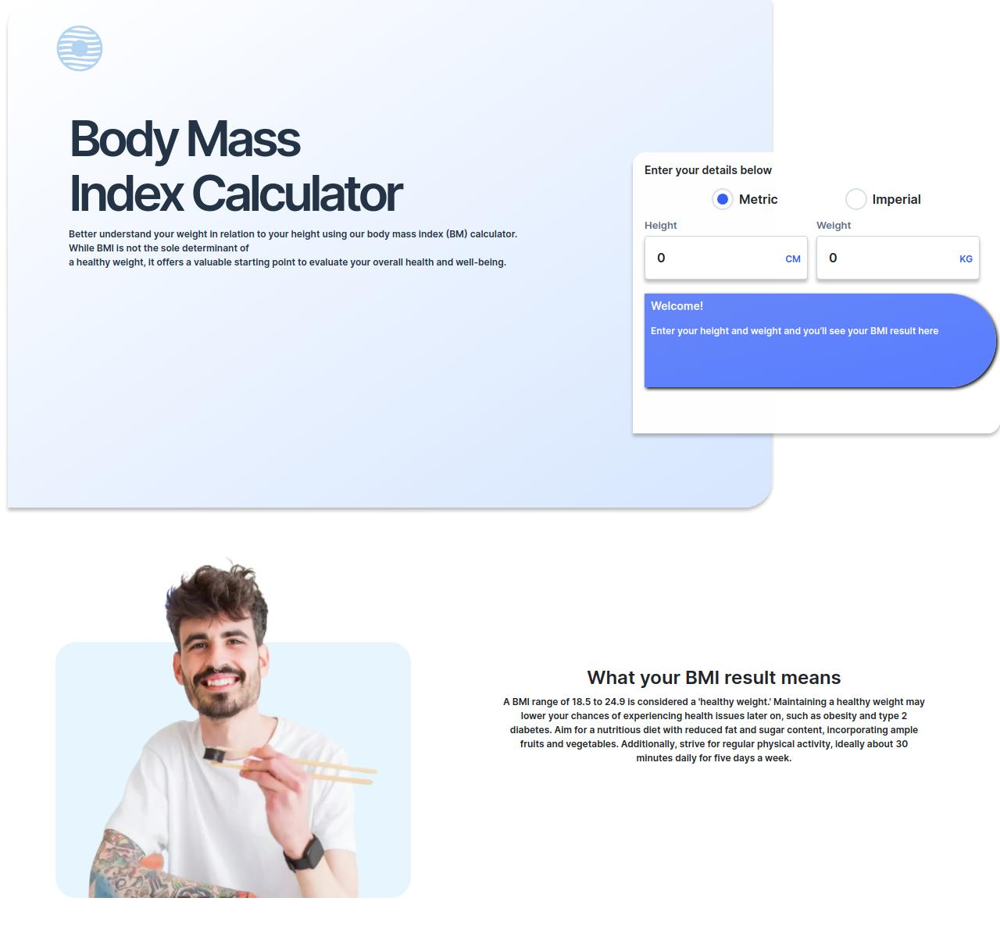
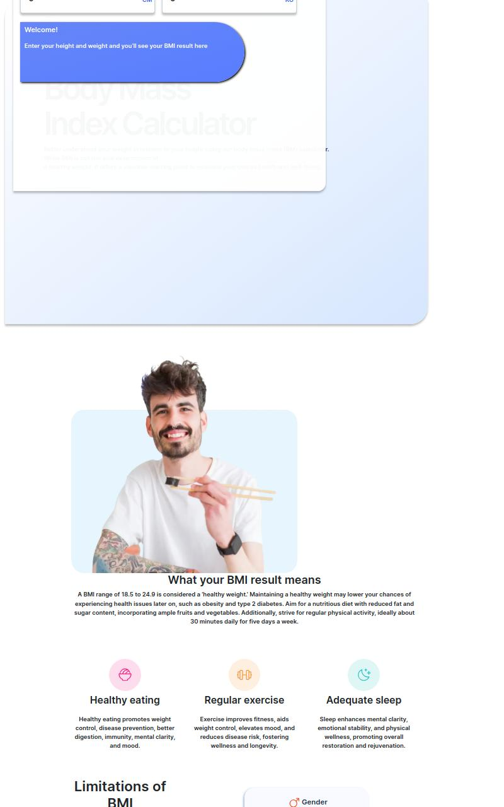
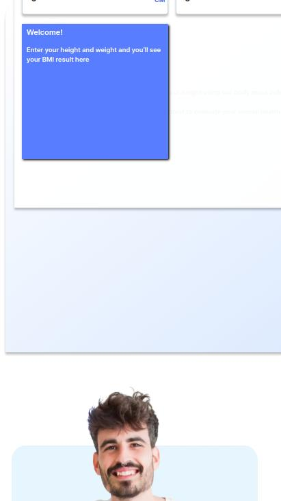

# Aqwas Task - Body Mass Index Calculator Solution

## Overview

Welcome to the Body Mass Index (BMI) Calculator! This project aims to help users better understand their weight in relation to their height using a BMI calculator. Below, you will find the key features and details about how to use and set up this project.

## Features

- **Metric and Imperial Units**: Users can select their preferred unit system (metric or imperial) to input their height and weight.
- **BMI Calculation**: The calculator computes the BMI based on the provided height and weight.
- **Weight Classification**: Based on the BMI result, the user is informed if they are underweight, have a healthy weight, are overweight, or are obese.
- **Healthy Weight Range**: The application displays the healthy weight range based on the user’s height.
- **Responsive Design**: The interface is optimized for different screen sizes, ensuring a seamless user experience on both desktop and mobile devices.
- **Interactive Elements**: The page includes hover and focus states for all interactive elements.

### BMI Categories

- **Underweight**: BMI less than 18.5
- **Healthy weight**: BMI 18.5 to 24.9
- **Overweight**: BMI 25 to 29.9
- **Obese**: BMI 30 or greater

## Usage

1. **Select Unit System**: Choose either metric or imperial units using the radio buttons.
2. **Enter Height and Weight**: Input your height and weight in the selected unit system.
3. **View Results**: The BMI, weight classification, and healthy weight range will be displayed based on the provided data.

### The Challenge

Users should be able to:

- Select whether they want to use metric or imperial units.
- Enter their height and weight.
- See their BMI result, with their weight classification and healthy weight range.
- View the optimal layout for the interface depending on their device's screen size.
- See hover and focus states for all interactive elements on the page.

### Screenshots

### Links

- Live Site URL: [BMI Calculator Live Site](https://bmi-calculator-task.vercel.app/)

## My Process

### Built With

- Semantic HTML5 markup
- CSS custom properties
- Flexbox
- CSS Grid
- Mobile-first workflow
- Bootstrap
- SCSS
